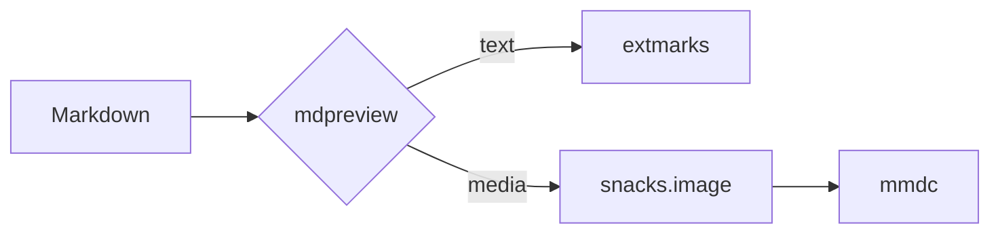
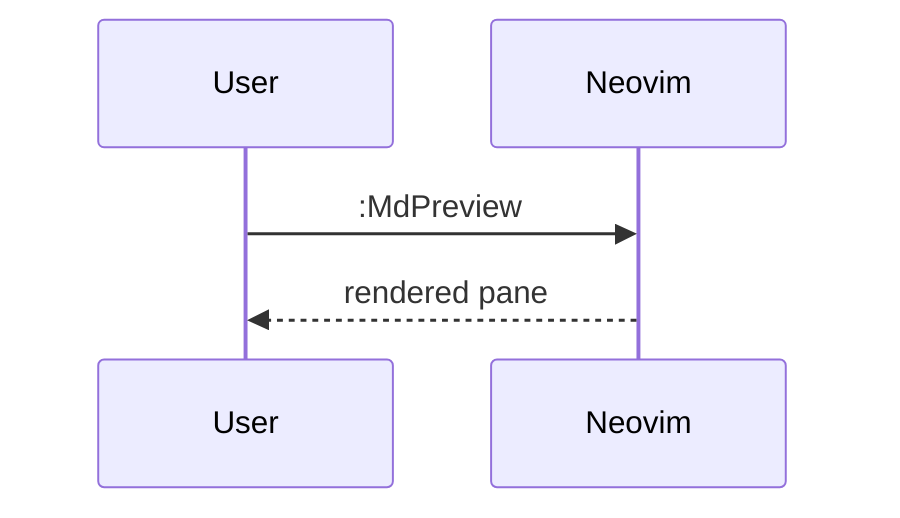

<!--
  docs/markdown-sample.md — every element and edge case the mdpreview renderer
  should handle. Open this file and run `:MdPreview` (<leader>mp) to exercise it.
-->

# H1 · Top-level heading

Paragraph directly under H1, to check that nothing above it is clipped.

Setext Heading Level 1
======================

Setext Heading Level 2
----------------------

## H2 · Second level

### H3 · Third level

#### H4 · Fourth level

##### H5 · Fifth level

###### H6 · Sixth level

## Heading with trailing hashes ##

##

###  A heading with extra spaces

#Heading with no space#

# **bold in heading** and `code` and [a link](https://example.com)

## Inline formatting

Plain, **bold**, *italic*, ***bold italic***, ~~strikethrough~~, `inline code`,
`code with \` backtick escape`, and a line with a soft
break plus a hard break at the end of this line.  
This text follows a hard break (two trailing spaces).

A backslash hard break at the end of this line\
and this line follows it.

Escapes: \*not italic\*, \_not italic\_, \`not code\`, \[not a link\], \# not a heading.

Entities: &amp; &lt; &gt; &quot; &copy; &nbsp;&mdash; and a non-breaking&nbsp;space.

Unicode and width: café, naïve, 日本語のテキスト, 한국어, emoji 👨‍👩‍👧‍👦 🚀, combining é (e + ́).

## Links

[inline link](https://example.com), [link with title](https://example.com "Title"),
[reference link][ref], [collapsed reference][], [shortcut reference], an autolink
<https://example.com/path?query=1>, an email <mail@example.com>, and a bare
https://example.com/bare-url.

A relative link: [docs/mdpreview.md](mdpreview.md) and an anchor: [jump to Code](#code-blocks).

[ref]: https://example.com/reference "Reference title"
[collapsed reference]: https://example.com/collapsed
[shortcut reference]: https://example.com/shortcut

## Images

Inline image: 
Image with title: 
Reference image: ![ref image][img-ref]

[img-ref]: images/reference.png

## Lists

- minus bullet
* star bullet
+ plus bullet

1. first ordered
2. second ordered
3. third ordered

1) parenthesis ordered
2) second
3) third

5. list starting at five
6. next

- loose item with a paragraph

  and a second paragraph in the same item

- tight item one
- tight item two

Nested:

- level 1
  - level 2
    - level 3
      - level 4
        - level 5
          - level 6

1. ordered level 1
   1. ordered level 2
      - mixed bullet level 3
        1. mixed ordered level 4

Task lists:

- [ ] unchecked task
- [x] checked lowercase
- [X] checked uppercase
- [ ] task with **bold** and `code` and [link](https://example.com)
  - [x] nested checked task

## Blockquotes

> single-level quote
> continued on the next line

> level one
> > level two
> > > level three

> quote containing a list:
>
> - first
> - second
>
> and a code span `x = 1`.

Callout-style quote:

> [!NOTE]
> This is a GitHub/Obsidian-style note callout.

> [!WARNING]
> A warning callout, to test rendering inside a quote.

## Code blocks

```lua
-- lua with a fence inside a string
local fence = "```"
local function hello(name)
  return ("hello, %s"):format(name)
end
print(hello("world"))
```

```python
def fib(n: int) -> int:
    a, b = 0, 1
    for _ in range(n):
        a, b = b, a + b
    return a
```

```javascript
const xs = [1, 2, 3].map((x) => x ** 2);
console.log(xs.join(", "));
```

```bash
set -euo pipefail
for f in *.md; do
  printf '%s\n' "$f"
done
```

```json
{ "name": "mdpreview", "version": "0.1.0", "nested": { "ok": true } }
```

```
a fence with no language
line two
```

~~~~text
a tilde fence
~~~~

Indented code block:

    indented line one
    indented line two
    if (x) { return y; }

## Tables

| Left | Center | Right |
| :--- | :----: | ----: |
| a    |   b    |     c |

| Name      | Value | Notes                     |
| --------- | ----- | ------------------------- |
| alpha     | 1     | **bold** and `code`       |
| beta      | 22    | [link](https://example.com) |
| gamma     | 333   | a\|escaped\|pipe          |
|           |       | empty first cell          |

| a | b |
|---|---|
| 1 | 2 |

## Horizontal rules

---

***

___

- - -

## Math

Display math as a fenced block (this is what snacks.image can render):

```math
E = mc^2
```

```math
\int_{-\infty}^{\infty} e^{-x^2}\,dx = \sqrt{\pi}
```

Inline math is not a treesitter node, so it renders as text: $a^2 + b^2 = c^2$.

## Diagrams





## Raw HTML and comments

<div align="center">
  <strong>raw HTML block</strong>
</div>

Inline <em>HTML</em> and a <br> line break tag.

<!-- an HTML comment that should be concealed -->

## Footnotes (GFM extension)

A sentence with a footnote.[^1] Another with a named one.[^note]

[^1]: The first footnote definition.
[^note]: The named footnote definition, with **markup**.

## Edge cases

A very long unbreakable token: aaaaaaaaaaaaaaaaaaaaaaaaaaaaaaaaaaaaaaaaaaaaaaaaaaaaaaaaaaaaaaaaaaaaaaaaaaaaaaaaaaaaaaaaaaaaaaaaaaaaaaaaaaaaaaaaaaaaaaaaaaaaaaaa.

Trailing whitespace after this line →

Tabs	between	words.

An empty list item:

-

A paragraph
that continues on the next line without a blank line.

> quote
> ---
> setext-looking content inside a quote

## Closing paragraph

If you can read this, the renderer reached the end of the document.
